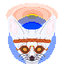

<div align="center">

[](https://spinozanilast.github.io/personal/)

```yaml
status: "building cool stuff"
availability: "open to interesting opportunities"
mission: "make developer workflow more awesome"
```

</div>

---

## _whoami_

Just a **guy** who loves crafting code, shipping projects, and optimizing the developer experience. No beautiful wife yet — but hey, there's always the next commit.

## ⚡ tech stack

### languages


### frameworks & runtimes


## 🤨 why are you here?

|  |  |
| -------------------------------------------------- | ------------------------------------------------------------------------------------------------------------------------------------------------------------------------------------------- |

[](https://spinozanilast.github.io/personal/)
---
